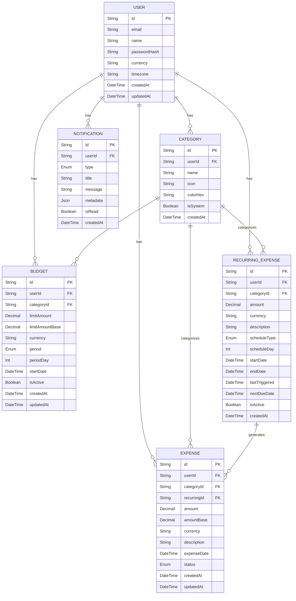

# ER Diagram

```mermaid
erDiagram
  USER ||--o{ CATEGORY : has
  USER ||--o{ EXPENSE : has
  USER ||--o{ BUDGET : has
  USER ||--o{ RECURRING_EXPENSE : has
  USER ||--o{ NOTIFICATION : has

  CATEGORY ||--o{ EXPENSE : categorizes
  CATEGORY ||--o{ BUDGET : tracks
  CATEGORY ||--o{ RECURRING_EXPENSE : categorizes

  RECURRING_EXPENSE ||--o{ EXPENSE : generates

  USER {
    String id PK
    String email
    String name
    String passwordHash
    String currency
    String timezone
    DateTime createdAt
    DateTime updatedAt
  }

  CATEGORY {
    String id PK
    String userId FK
    String name
    String icon
    String colorHex
    Boolean isSystem
    DateTime createdAt
  }

  EXPENSE {
    String id PK
    String userId FK
    String categoryId FK
    String recurringId FK
    Decimal amount
    Decimal amountBase
    String currency
    String description
    DateTime expenseDate
    Enum status
    DateTime createdAt
    DateTime updatedAt
  }

  RECURRING_EXPENSE {
    String id PK
    String userId FK
    String categoryId FK
    Decimal amount
    String currency
    String description
    Enum scheduleType
    Int scheduleDay
    DateTime startDate
    DateTime endDate
    DateTime lastTriggered
    DateTime nextDueDate
    Boolean isActive
    DateTime createdAt
  }

  BUDGET {
    String id PK
    String userId FK
    String categoryId FK
    Decimal limitAmount
    Decimal limitAmountBase
    String currency
    Enum period
    Int periodDay
    DateTime startDate
    Boolean isActive
    DateTime createdAt
    DateTime updatedAt
  }

  NOTIFICATION {
    String id PK
    String userId FK
    Enum type
    String title
    String message
    Json metadata
    Boolean isRead
    DateTime createdAt
  }
```