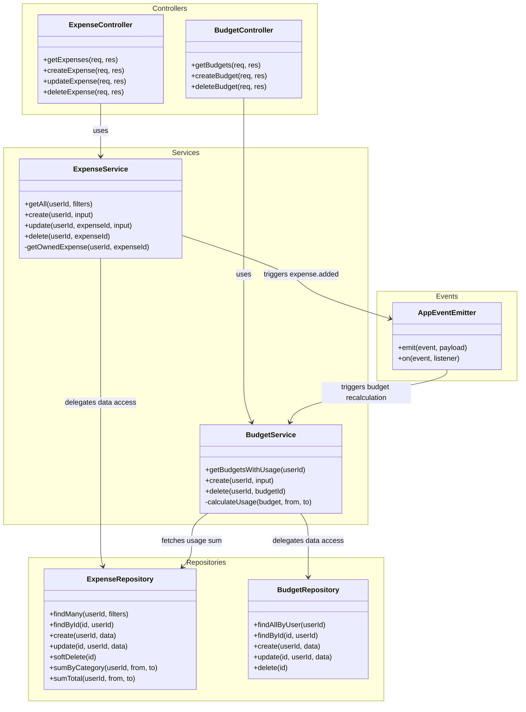

# Class Diagram

```mermaid
classDiagram
  direction TB

  namespace Controllers {
    class ExpenseController {
      +getExpenses(req, res)
      +createExpense(req, res)
      +updateExpense(req, res)
      +deleteExpense(req, res)
    }
    class BudgetController {
      +getBudgets(req, res)
      +createBudget(req, res)
      +deleteBudget(req, res)
    }
  }

  namespace Services {
    class ExpenseService {
      +getAll(userId, filters)
      +create(userId, input)
      +update(userId, expenseId, input)
      +delete(userId, expenseId)
      -getOwnedExpense(userId, expenseId)
    }
    class BudgetService {
      +getBudgetsWithUsage(userId)
      +create(userId, input)
      +delete(userId, budgetId)
      -calculateUsage(budget, from, to)
    }
  }

  namespace Repositories {
    class ExpenseRepository {
      +findMany(userId, filters)
      +findById(id, userId)
      +create(userId, data)
      +update(id, userId, data)
      +softDelete(id)
      +sumByCategory(userId, from, to)
      +sumTotal(userId, from, to)
    }
    class BudgetRepository {
      +findAllByUser(userId)
      +findById(id, userId)
      +create(userId, data)
      +update(id, userId, data)
      +delete(id)
    }
  }

  namespace Events {
    class AppEventEmitter {
      +emit(event, payload)
      +on(event, listener)
    }
  }

  ExpenseController --> ExpenseService : uses
  BudgetController --> BudgetService : uses

  ExpenseService --> ExpenseRepository : delegates data access
  BudgetService --> BudgetRepository : delegates data access
  BudgetService --> ExpenseRepository : fetches usage sum

  ExpenseService --> AppEventEmitter : triggers expense.added
  AppEventEmitter --> BudgetService : triggers budget recalculation
```