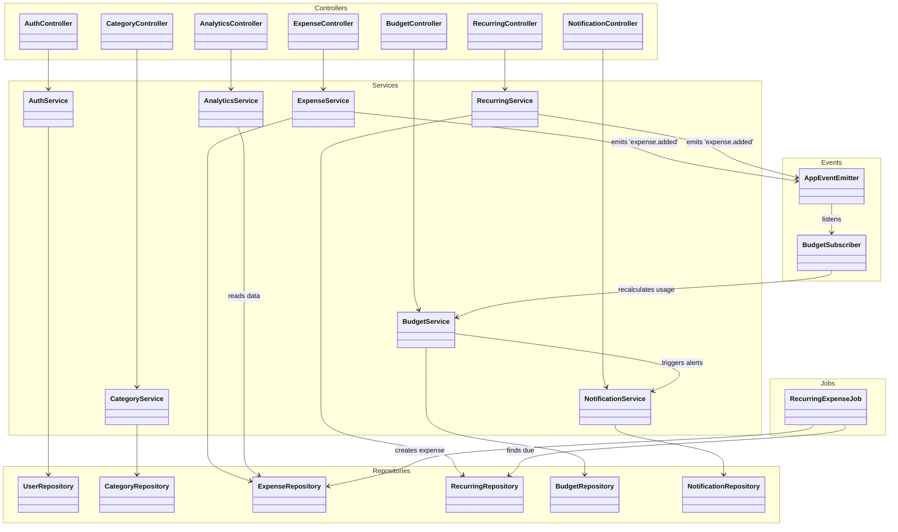

# Class Diagram

```mermaid
classDiagram
  direction TB

  namespace Controllers {
    class AuthController
    class CategoryController
    class ExpenseController
    class RecurringController
    class BudgetController
    class AnalyticsController
    class NotificationController
  }

  namespace Services {
    class AuthService
    class CategoryService
    class ExpenseService
    class RecurringService
    class BudgetService
    class AnalyticsService
    class NotificationService
  }

  namespace Repositories {
    class UserRepository
    class CategoryRepository
    class ExpenseRepository
    class RecurringRepository
    class BudgetRepository
    class NotificationRepository
  }

  namespace Events {
    class AppEventEmitter
    class BudgetSubscriber
  }

  namespace Jobs {
    class RecurringExpenseJob
  }

  %% Controller -> Service Dependencies
  AuthController --> AuthService
  CategoryController --> CategoryService
  ExpenseController --> ExpenseService
  RecurringController --> RecurringService
  BudgetController --> BudgetService
  AnalyticsController --> AnalyticsService
  NotificationController --> NotificationService

  %% Service -> Repository Dependencies
  AuthService --> UserRepository
  CategoryService --> CategoryRepository
  ExpenseService --> ExpenseRepository
  RecurringService --> RecurringRepository
  BudgetService --> BudgetRepository
  AnalyticsService --> ExpenseRepository : reads data
  NotificationService --> NotificationRepository

  %% Event Driven Flow
  ExpenseService --> AppEventEmitter : emits 'expense.added'
  RecurringService --> AppEventEmitter : emits 'expense.added'
  AppEventEmitter --> BudgetSubscriber : listens
  BudgetSubscriber --> BudgetService : recalculates usage
  BudgetService --> NotificationService : triggers alerts

  %% Cron Jobs
  RecurringExpenseJob --> RecurringRepository : finds due
  RecurringExpenseJob --> ExpenseRepository : creates expense
```