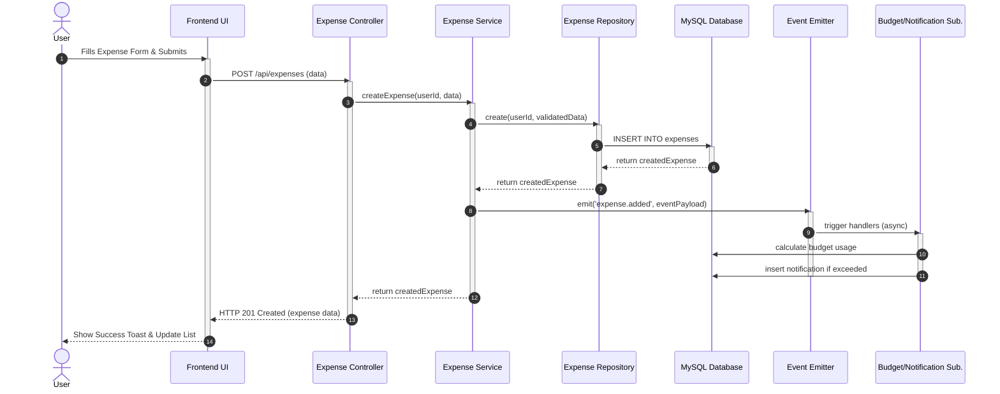

# Sequence Diagram

```mermaid
sequenceDiagram
  autonumber
  actor User
  participant UI as Frontend UI
  participant Controller as Expense Controller
  participant Service as Expense Service
  participant Repo as Expense Repository
  participant DB as MySQL Database
  participant Events as Event Emitter
  participant Sub as Budget/Notification Sub.

  User->>UI: Fills Expense Form & Submits
  activate UI
  
  UI->>Controller: POST /api/expenses (data)
  activate Controller
  
  Controller->>Service: createExpense(userId, data)
  activate Service
  
  Service->>Repo: create(userId, validatedData)
  activate Repo
  
  Repo->>DB: INSERT INTO expenses
  activate DB
  DB-->>Repo: return createdExpense
  deactivate DB
  
  Repo-->>Service: return createdExpense
  deactivate Repo
  
  Service->>Events: emit('expense.added', eventPayload)
  activate Events
  Events->>Sub: trigger handlers (async)
  activate Sub
  Sub->>DB: calculate budget usage
  Sub->>DB: insert notification if exceeded
  deactivate Sub
  deactivate Events
  
  Service-->>Controller: return createdExpense
  deactivate Service
  
  Controller-->>UI: HTTP 201 Created (expense data)
  deactivate Controller
  
  UI-->>User: Show Success Toast & Update List
  deactivate UI
```