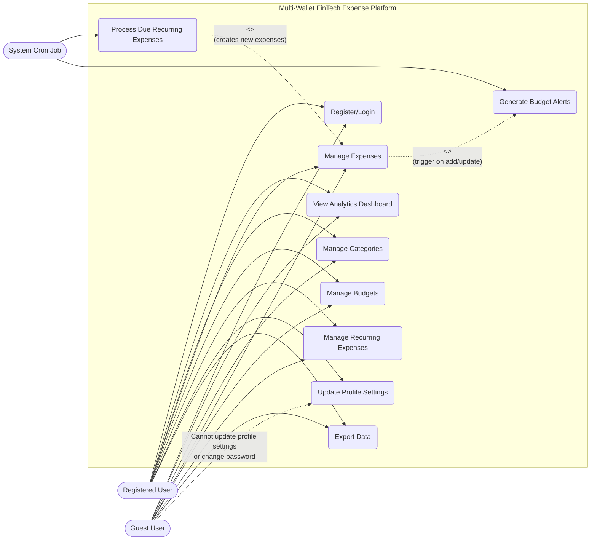

# Use Case Diagram

```mermaid
flowchart LR
  %% Actors
  User(["Registered User"])
  Guest(["Guest User"])
  System(["System Cron Job"])

  %% System Boundary
  subgraph Multi-Wallet FinTech Expense Platform
    direction TB
    UC_Login("Register/Login")
    UC_Dashboard("View Analytics Dashboard")
    UC_Category("Manage Categories")
    UC_Expense("Manage Expenses")
    UC_Budget("Manage Budgets")
    UC_Recurring("Manage Recurring Expenses")
    UC_Profile("Update Profile Settings")
    UC_Export("Export Data")
    
    UC_Cron("Process Due Recurring Expenses")
    UC_Alerts("Generate Budget Alerts")
  end

  %% User Relationships
  User --> UC_Login
  User --> UC_Dashboard
  User --> UC_Category
  User --> UC_Expense
  User --> UC_Budget
  User --> UC_Recurring
  User --> UC_Profile
  User --> UC_Export

  %% Guest Relationships
  Guest --> UC_Login
  Guest --> UC_Dashboard
  Guest --> UC_Category
  Guest --> UC_Expense
  Guest --> UC_Budget
  Guest --> UC_Recurring
  Guest --> UC_Export

  %% Guest constraint note
  Guest -.-> |"Cannot update profile settings\nor change password"| UC_Profile

  %% System Relationships
  System --> UC_Cron
  System --> UC_Alerts

  %% Includes
  UC_Expense -.-> |"<<includes>>\n(trigger on add/update)"| UC_Alerts
  UC_Cron -.-> |"<<includes>>\n(creates new expenses)"| UC_Expense
```